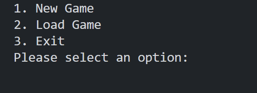
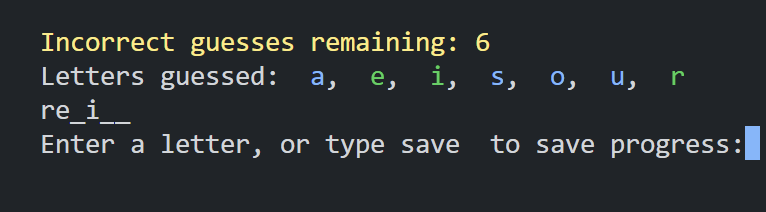

<h1 align="center">Hangman Game</h1>

This is a console game made with Ruby and YAML for studying purposes

</img>
</img>

### Tools

The following tools have been used in the project:

- [Ruby](https://www.ruby-lang.org/pt/)
- [YAML](https://yaml.org/)
- [VS Code](https://code.visualstudio.com)
---

### Author
Made by Johan Stromberg :fire: 
 

---
[Live Server](https://replit.com/@johanrecaman/hangman)

<h4 align="center">
  🚧  Work In Progress...  🚧
</h4>
